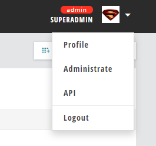
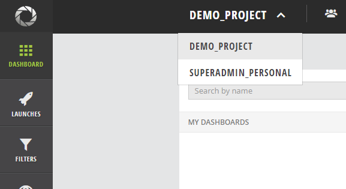
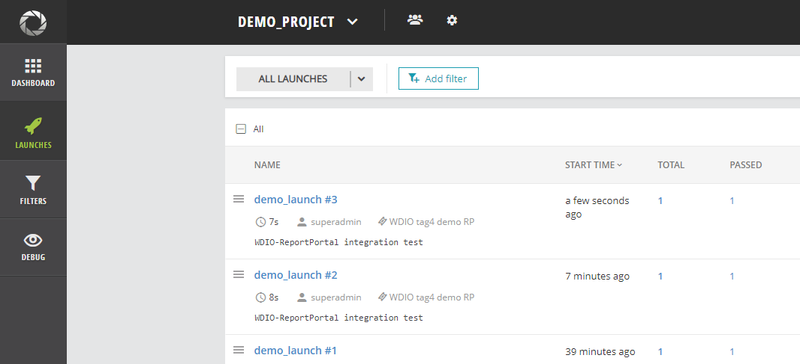
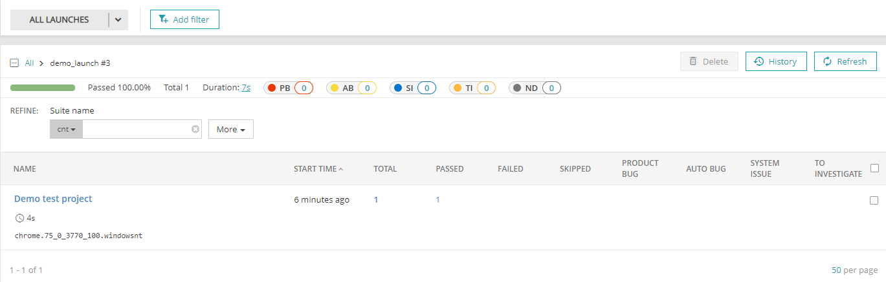
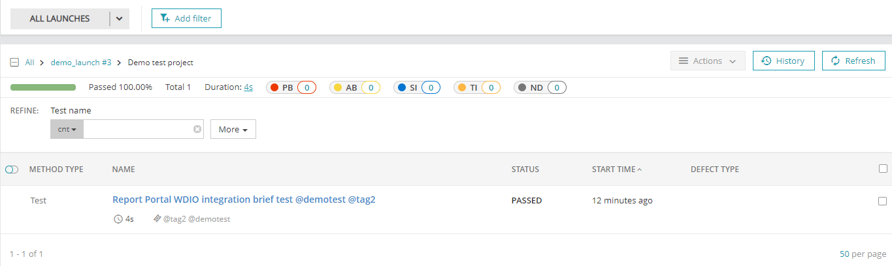
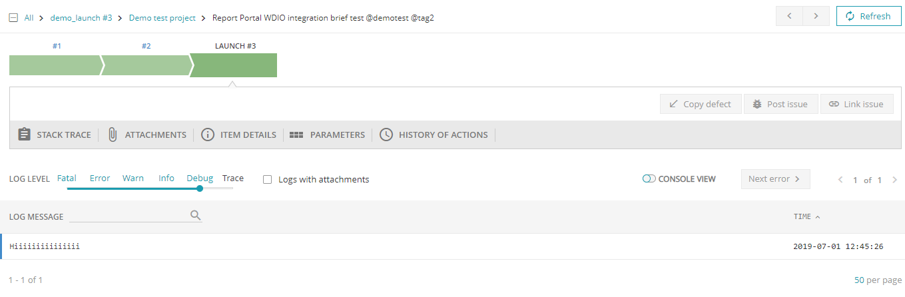

The guide goes throught steps required to setup test automation project based on WebDriver.io in order to work with Report Portal. To keep this guide focus on Report Portal integration with Specflow, info needed to setup adjacent tools is rather provided by references to a dedicated resources than reviewed directly with steps needed.

# Setting up Report Portal

- install Report Portal

Follow steps here to install the service on Docker: https://reportportal.io/download.
Allocate Docker with resources enough to satisfy Report Portal needs: set RAM >= 5Gb; make drive C available for containers.

- check installation

Once the service is up, refer to the 3rd step of the following page for login instructions: https://reportportal.io/download.

# Test automation project configuration

## Prerequisites

In order to develop and run WDIO-based tests a development machine needs Node.js and NPM to be installed. Node.js is required since WDIO itself is based on it. WDIO CLI is provided as NPM module so NPM (Node.js package manager) is also required. NPM is usually provided with Node.js installation.

> Node.js and NPM is required for any WDIO project development

Once the tools mentioned above are installed one may begin test automation project development. WDIO project starts from project configuration step. The configuration is easily done thanks to specialized project configuration wizard `wdio` CLI provides.

> `wdio` is a CLI bundled as a NPM module that incorporates a test runner and an interactive test
project configuration tool. It provides convenient interface for working with a test project.

WDIO project configuration file describes how and where tests are run, which test framework to use, how to track and represent test results, which other tools to use. The configuration is written in JSON format, default file name is "wdio.config.json". One may create it manually but the most effective way is to benefit from project configuration wizard provided by WDIO CLI.

> WDIO project configuration wizard produces project config file based on answers given on keys question about project configuration.

## Test scenario description

The demo test automation project contains an E2E test for Report Portal which integration between the test project and Report Portal. The scenario makes sure that info about a test run that appears on the portal matches the info we set for the test run:

- test suite name - suite name shown on the portal is expected to be the same as specified in the project
- test scenario name - test name shown on the portal is expected to be the same as specified in the project
- test tags - test tags shown on the portal is expected to be the same as specified in the project
- Report Portal launch* name
- Report Portal launch* tags
- test log - test log message shown on the portal is expected to have a level and a message the same as specified for send log request

**Note: test launch is a unit representing a single test execution on Report Portal*

*Test scenario implementation is not reviewed in the guide since it is more about WDIO knowledge scope does not correspond to the topic directly. Feel free to investivate the scenario implementation on your own.*

## Preparing Report Portal

In order to report test execution results to Report Portal, test automation project needs to provide the following info:
- Report Portal instance address the results will be reported to
- user identity the results will be uploaded by
- project name

Project is an organizational unit of test launches in Report Portal. Each test launch has a project assigned.
- test launch properties

---

Login to a service instance and perform the next steps:

1. Go through the projects list and pick the one where test results are expected to come into

If there no such project, go to `Administrate->Add project` and create it



2. Take uuid from `Profile` screen

The value will be used to authorize test automation project to the service

## Test project setup

Here we will go throught the steps needed to integrate a WDIO project with Report Portal. As you may notice the project already has WDIO configuration file with NPM related files. In fact, Report Portal integration is done using those files. The rest of the guide will cover how to prepare those configuration ourserves, so before continuing please move or rename files so you will have a chance to refer to them if any issues appear. Here are the mentioned files:
- wdio.conf.js
- package.json
- package-lock.json
---
Steps required to initialize WDIO project:

1. Initialize NPM package

The fastest way to accomplish it is to initialize a package with default values:

```bash
npm init -y
```
2. Install WDIO CLI

```bash
npm i --save-dev @wdio/cli
```

3. Run WDIO project configuration wizard

```bash
npx wdio config
```

4. Choose options provided by configuration wizard

Pick default values except for these questions:
- framework: Jasmine
- test spec location: ./tests/*.js
- reporters: Report Portal
- services: reportportal, chromedriver
5. Prepare Report Portal reporter config file

Config file format is demonstrated here: https://webdriver.io/docs/wdio-reportportal-reporter.html#configuration. The page demonstrates an example with combined Report portal and WDIO configuration, but we will separate it. Take a value of `conf` object and put it in a separate file in the project root, name it "ReportPortal.config.json"

Change `URL`, `uuid`, `project` to actual values. Use values obtained during the previous section (project, uuid). Notice that `uuid` may change between service restarts, so if test results will not be coming to the service, make sure the specified `uuid` is still actual.

For a simple local hosted experiments use HTTP for connection when specifying `URL` value. To learn about SSL setup visit: https://reportportal.io/docs/Setup-SSL .

File used for this project is following:

ReportPortal.config.json
```json
{
  "reportPortalClientConfig": {
    "token": "00000000-0000-0000-0000-00000000000",
    "endpoint": "http://localhost:8080/api/v1",
    "launch": "demo_launch",
    "project": "demo_project",
    "debug": false,
    "description": "WDIO-ReportPortal integration test",
      "tags": [
        "demo",
        "RP",
        "WDIO",
        "tag4"
      ]
  },
  "reportSeleniumCommands": false,
  "seleniumCommandsLogLevel": "debug",
  "parseTagsFromTestTitle": true
}
```
*notice token value is a stub. We will populate an actual value in the next step*

6. Keep sensitive data separatedly

It is recommended to keep sensitive data in secret, so we are not going to commit any to the repo. Let's instead use `dotenv` to conveniently provide and access such data in the project: https://www.npmjs.com/package/dotenv. Get familiar with its page on NPM repo, install it (`npm i dotenv -D`) and then create `.env` file in the project root with values for these variables:

- RP_USERNAME
Name of the user who will be used by auto test to verify 
- RP_PASSWORD
User password
- RP_USERUUID.
User UUID. Refer to Preparing Report Portal for instructions how to get it.

7. Modify WDIO config to support ReportPortal

The final step we need to do is to notify WDIO that we want to use NPM modules responsible for integration with RP. Report Portal support is enabled by 2 NPM modules: `wdio-reportportal-reporter` and `wdio-reportportal-service`. Refer to the corresponding NPM repo pages for their description. To activate the modules insert the following snippet for project config file (wdio.config.js) at the beginning:

```JS
require('dotenv').config()
const reportportal = require('wdio-reportportal-reporter');
const RpService = require("wdio-reportportal-service");

const rpConf = JSON.parse(require('fs').readFileSync('ReportPortal.config.json'));
rpConf.reportPortalClientConfig.token = process.env.RP_USERUUID
```

and add these values to `services` and `reporters` arrays respectively:

For `services` array:
```JS
[RpService, {}]
```
For `reporters` array:
```JS
[reportportal, rpConf]
```
if the arrays mentioned above (services, reporters) have values 'reportportal' present as strings then remove them.

# Test the integration

Configuration is complete, so it is the time to make sure integration works.
Run all tests again and go to Report Portal.

0. Run test project

Invoke WDIO test runner by this command:
```bash
npx wdio
```
On finish go to RP and follow the next steps.
1. Pick the project you pointed to report test results to. In this case it is "demo_project"


2. Open launches/debug tab to see test results

There 2 screens where test runs info can be displayed on the platform: debug and launches. By default test results appear in `launches` screen, but if test execution was done with Report Portal config property `debug` set to `true`, the results will appear on the debug screen instead. Read here about the screens: https://reportportal.io/docs/View-launches .

Since `debug` is `false` for the current project, test runs appear on `launches` screen.

Pay attention how the test run info reflects configuration set in the test automation project (ReportPortal.config.json):
- test run title is equal to `launch.name`
- tags are those specified in `launch.tags`
- user specified below title is the one used to authenticate test project by. His key is used in `reportPortalClientConfig.token`

3. Look inside a test run



Open the last test run. Pay attention each clause represents test suite with its title displayed.

Looking inside a test suite to see a list of tests executed within the test suite:



And finally, each test keeps logs and attachments provided during its execution and we can see them navigating to a corresponding test.


# Next steps

The guide finishes at this point. To learn more about the tools used throughout the guide visit the corresponding resources:

- Report Portal: https://reportportal.io
- WebDriverIO: https://webdriver.io
- Docker: https://www.docker.com
- Dotenv: https://www.npmjs.com/package/dotenv